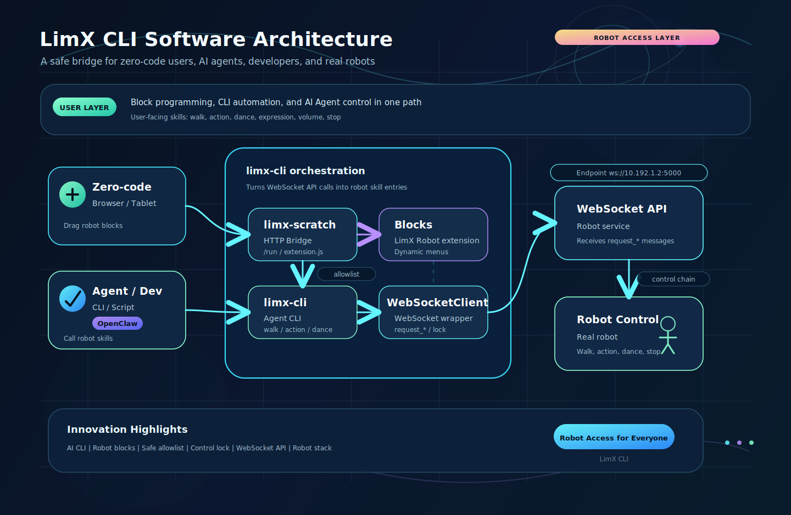

# LimX CLI

English | [中文](README_cn.md)

LimX CLI is a skill control and orchestration layer built on top of the LimX robot WebSocket API. It wraps the robot's `request_*` control interfaces into two easier-to-use entry points:

- `limx-cli`: a command-line tool for AI Agents, automation scripts, and developers.
- `limx-scratch`: a local service for Scratch visual programming, with the built-in `LimX Robot` block extension.

It is intended for robot skill inspection, demos, education, automation, and safe agent-assisted operation. It is not a replacement for the robot control stack, firmware, safety controller, or the signaling service itself. It does not provide cloud account management, fleet management, long-running production orchestration, or authorization policy enforcement beyond the robot control lock APIs exposed by signaling.

Current status: `0.1.0` initial open-source release candidate. The CLI and Scratch bridge are usable for local development and robot smoke tests. Hardware coverage is currently focused on Oli-style workflows; other robot families and production deployment patterns may need additional validation.



## 1. Features

- **Easy to use**: users can build robot behaviors with blocks, while developers and Agents can call the same capabilities through the CLI.
- **Supports Oli robot**: supports common skills such as state queries, motion control, actions, dances, emojis, and volume control. Support for other robots is coming soon.
- **Automation friendly**: the CLI outputs JSON by default and supports dry-run, making it suitable for scripts, AI Agents, and test flows.
- **Easy to deploy**: CMake builds an installable bundle, with `limx-cli` and `limx-scratch` available directly after installation.

## 2. Intended Audience

- Robot application developers who need a scriptable interface to the LimX signaling WebSocket API.
- AI Agent tool builders who need a JSON-first, dry-run-friendly robot skill entry point.
- Educators, demo engineers, and operators who want Scratch-style visual programming for robot behaviors.
- Contributors who want to improve the CLI, Scratch bridge, docs, packaging, or tests.

## 3. Architecture Overview

Typical flow:

1. A user sends a robot skill command through Scratch blocks, CLI, scripts, or an AI Agent.
2. `limx-scratch` converts visual block requests into limited CLI calls.
3. `limx-cli` converts high-level skill commands into WebSocket API `request_*` messages.
4. The WebSocket API forwards the requests to the robot control system.

## 4. Prerequisites

- Linux x86_64 or aarch64.
- Python `>= 3.8`.
- CMake `>= 3.16`.
- Access to the LimX robot WebSocket API. The default address is `ws://10.192.1.2:5000`.
- Building the Scratch static site requires Node.js / npm on the build machine.
- The CMake deployment bundle includes the specified Node.js runtime, so the target machine does not need a system Node.js installation to run `limx-scratch`.

On Ubuntu / Debian:

```bash
sudo apt update
sudo apt install -y build-essential cmake python3 python3-pip curl
```

Install Node.js `22.22.0` with nvm:

```bash
# nvm example
curl -fsSL https://raw.githubusercontent.com/nvm-sh/nvm/v0.39.7/install.sh | bash
. "$HOME/.nvm/nvm.sh"
nvm install 22.22.0
nvm use 22.22.0
node --version
npm --version
```

Python dependency:

```bash
python3 -m pip install websocket-client
```

For development tests:

```bash
python3 -m pip install pytest
```

## 5. Quick Start

```bash
cd limx-cli
python3 -m pip install websocket-client pytest
python3 -m pytest tests/ -q

# Run without installing, useful during development.
python3 -m limx-cli.cli --dry-run state mode

# Build and install the copyable runtime bundle.
cmake -S . -B build
cmake --build build
cmake --install build --prefix install
export PATH="$PWD/install/bin:$PATH"

limx-cli --help
limx-cli --host 10.192.1.2 --port 5000 state mode
limx-scratch --listen-host 0.0.0.0 --listen-port 6080
```

Use `--dry-run` before high-risk motion, action, dance, audio, or display changes.

## 6. Build And Install With CMake

Build with CMake:

```bash
cd limx-cli
cmake -S . -B build
cmake --build build
```

Install for local testing:

```bash
cmake --install build --prefix install
```

After installation:

- `limx-cli` is installed to `install/bin/limx-cli`.
- `limx-scratch` is installed to `install/bin/limx-scratch`.
- Runtime resources are installed under `install/bin/limx-cli.bin/`.

Use the local installation directory:

```bash
export PATH="$PWD/install/bin:$PATH"

limx-cli --help
limx-scratch --help
```

Install system-wide to `/usr/local`:

```bash
sudo cmake --install build --prefix /usr/local
```

After system installation:

- `limx-cli` is installed to `/usr/local/bin/limx-cli`.
- `limx-scratch` is installed to `/usr/local/bin/limx-scratch`.
- Runtime resources are installed under `/usr/local/bin/limx-cli.bin/`.

## 7. Usage

### 5.1 Configure Robot Connection

The default connection is `10.192.1.2:5000`. It can be overridden with command-line arguments:

```bash
limx-cli --host 10.192.1.2 --port 5000 state mode
```

Environment variables can also be used:

```bash
export LIMX_ROBOT_HOST=10.192.1.2
export LIMX_ROBOT_PORT=5000
```

### 5.2 CLI

Common commands:

```bash
# State queries
limx-cli state mode
limx-cli state joint
limx-cli state imu

# Actions and dances
limx-cli action list
limx-cli action run --name wave_greet_bye --timeout 120
limx-cli dance list
limx-cli dance run --rc-mapping solo_shake --timeout 660

# Motion control
limx-cli motion standup
limx-cli motion walk --x 0.1 --y 0 --yaw 0 --duration 2
limx-cli motion sit

# Emojis and volume
limx-cli emoji list
limx-cli emoji set smile
limx-cli audio set-volume 60
```

`limx-cli` outputs JSON by default, making it easy for Agents and automation scripts to parse:

```bash
limx-cli state mode
limx-cli action list
limx-cli --dry-run motion walk --x 0.1 --duration 3
```

`--dry-run` shows the planned request without controlling the robot.

### 5.3 Agent Skill Usage

The repository provides `SKILL.md` so OpenClaw, ZeroClaw, Cursor, Claude Code, and other Agent Skill compatible tools can understand how to call `limx-cli` safely.

Usage:

1. Install `limx-cli` following Section 4 and confirm it is available in the current shell:

```bash
limx-cli --help
```

2. Add `limx-cli/SKILL.md` to the skill directory of the corresponding tool, or reference this file in the tool configuration.

Common locations:

| Tool | Usage |
| --- | --- |
| OpenClaw / ZeroClaw | Place `SKILL.md` in the project or workspace skills directory and let the Agent load it |
| Cursor | Place `SKILL.md` in a Cursor-discoverable skill directory, or open it with the project so the Agent can read it |
| Claude Code | Copy it to `~/.claude/skills/limx-cli/SKILL.md` |

3. Set robot connection environment variables:

```bash
export LIMX_ROBOT_HOST=10.192.1.2
export LIMX_ROBOT_PORT=5000
```

4. Ask the Agent natural-language tasks, for example:

```text
Check the current robot state
List available actions
Plan a dry-run forward walk at 0.1 m/s for 3 seconds
```

`SKILL.md` guides the Agent to prefer JSON output, dry-run high-risk motions first, and use existing CLI subcommands to access robot capabilities.

### 5.4 Scratch Visual Programming


Start the Scratch local service:

```bash
limx-scratch
```

To allow phones, tablets, or WebViews on the same LAN to access it:

```bash
limx-scratch --listen-host 0.0.0.0 --listen-port 6080
```

Open the Scratch page address printed by `limx-scratch` in a browser.

The Scratch page shows the `LimX Robot` category. Common blocks include:

- Query robot state.
- Enter stand, walk, damp, and zero-torque modes.
- Run actions and dances.
- Walk for a specified duration with `x/y/yaw`.
- Set emojis and volume.
- Refresh action and dance lists.
- Stop the robot.

Classroom and demo modes can use dry-run:

```bash
limx-scratch --dry-run
```

## 8. Environment Variables

| Environment Variable | Default | Description |
| --- | --- | --- |
| `LIMX_ROBOT_HOST` | `10.192.1.2` | WebSocket API host |
| `LIMX_ROBOT_PORT` | `5000` | WebSocket API port |
| `LIMX_SCRATCH_LISTEN_HOST` | `0.0.0.0` | Scratch local service listen address |
| `LIMX_SCRATCH_LISTEN_PORT` | `6080` | Scratch local service listen port |
| `LIMX_SCRATCH_MENU_TIMEOUT` | `5` | Action/dance menu preload timeout |
| `LIMX_SCRATCH_PYTHON` | `python3` | Python executable |

## 9. Tests

Run unit tests:

```bash
cd limx-cli
python3 -m pytest tests/ -q
```

If pytest is not installed:

```bash
python3 -m unittest discover -s tests -v
```

Run robot smoke tests from lower risk to higher risk:

```bash
limx-cli state mode
limx-cli state joint
limx-cli action list
limx-cli dance list
limx-cli --dry-run motion walk --x 0.05 --duration 1
```

## 10. Open Source Notes

LimX CLI provides an easier and more composable entry point for robot skills: AI Agents can call it, developers can script it, and users can build behaviors with blocks.

License notes:

- Except for third-party components, the self-developed parts of LimX CLI are licensed under the Apache License 2.0.
- `scratch-app` is based on Scratch GUI and retains its original GPL-3.0 license notices and copyright information.
- If a release includes `scratch-app` or Scratch pages built from it, the distribution must also comply with GPL-3.0 requirements.
